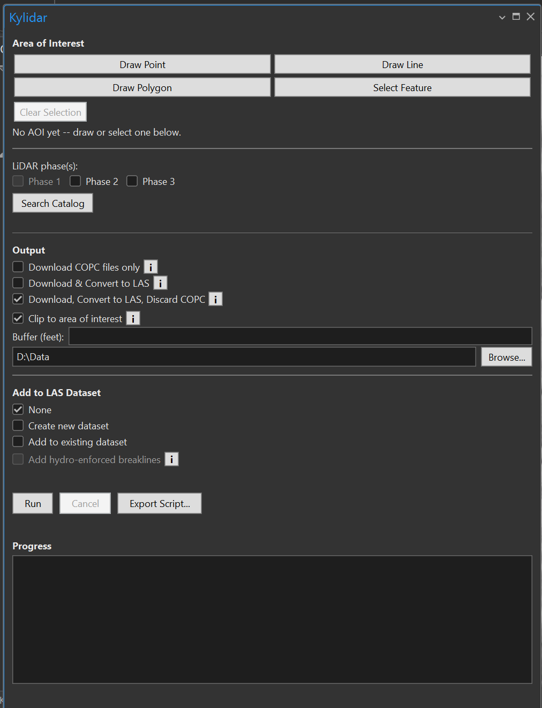

# Getting Started

## Open the pane

Click the **Kylidar** tab, then the **Kylidar** button. This opens a dockable pane (docked
alongside the Contents pane by default) that stays open as you work.

**Feedback** and **Help**, at the top of the pane, are available any time: **Feedback** opens a
dialog to report a bug or request a feature -- either on GitHub, or straight to the developer with
no GitHub account needed -- and **Help** opens this documentation site in your browser. **Check
version** compares your installed build with the [latest release](https://github.com/ianhorn/kylidar-addin/releases/latest)
and, if there's a newer one, offers to open its download page (close ArcGIS Pro before installing it).

{ width="615" loading=lazy }

The pane reads top to bottom in the order you'd use it: set the area of interest, pick the phase(s),
choose the output, optionally build a LAS dataset, then **Run** (or **Export Script...**) and watch
the **Progress** log.

## A first run, end to end

The pane below is set up for a typical run: a polygon AOI, Phase 3, one tile found by **Search
Catalog**, clipping to the AOI with a 100 ft buffer, and a new LAS dataset with hydro-enforced
breaklines. The steps that follow explain each part.

{ width="420" loading=lazy }

1. **Set an area of interest.** Under **Area of Interest**, click **Draw Point**, **Draw Line**,
   **Draw Polygon**, or **Select Feature** and define your AOI on the active map, or **Browse for
   File...** to use a shapefile or geodatabase feature class from disk without first adding it as a
   layer. The status line below the buttons updates to confirm what was captured (e.g. "AOI ready:
   Polygon AOI"), and a persistent Map Notes feature is added to the map (drawn AOIs only). See
   [Area of Interest](area-of-interest.md) for details, or **Clear Selection** to start over.
2. **Choose LiDAR phase(s).** Check one or more phases. Phase 1 is disabled here -- see
   [LiDAR phases](clip-and-run.md#lidar-phases).
3. **(Optional) Search Catalog.** Click **Search Catalog** to preview how many tiles match your
   AOI and phase selection before running anything.
4. **Choose an output mode.** Pick one of **Download COPC file(s) only**, **Download & Convert to
   LAS**, or **Download, Convert to LAS, Discard COPC** (the default). Each has an **i** button
   explaining the disk-space/speed tradeoff. See [Output modes](clip-and-run.md#output-modes).
5. **(Optional) Clip to area of interest.** Check this to crop each tile to the AOI during
   conversion; a **Buffer (feet)** field appears when checked. See
   [Clipping](clip-and-run.md#clipping-to-the-area-of-interest).
6. **(Optional) Compress to zLAS.** Check this to compress the converted `.las` output to Esri's
   own zLAS format -- needs the 3D Analyst extension. See
   [Compress to zLAS](clip-and-run.md#compress-to-zlas).
7. **Set the output folder.** Defaults to a timestamped folder inside the current project's own
   folder; use **Browse...** to pick somewhere else.
8. **(Optional) Add to LAS Dataset.** Choose **Create new dataset** or **Add to existing dataset**
   to fold the output `.las` (or `.zlas`) file(s) into a `.lasd` and add it to the map once the run
   finishes. With a dataset chosen you can also check **Add hydro-enforced breaklines** to add the
   Phase 2/3 breaklines inside the AOI as a surface constraint -- see
   [Hydro-enforced breaklines](clip-and-run.md#hydro-enforced-breaklines).
9. **Click Run.** The pane's progress log fills in live as tiles are found, downloaded, and
   converted. **Cancel** stops an in-progress run.

!!! tip "Re-running with different settings"
    You can change the phases, output mode, clip/buffer, or output folder and click **Run** again
    without redrawing the AOI -- the AOI persists in the pane (and as a Map Notes feature) until
    you draw or select a new one, or click **Clear Selection**.

!!! tip "Running without ArcGIS Pro"
    Click **Export Script...** instead of **Run** to write a stand-alone download/convert script
    for the current AOI's tiles -- useful for very large batches, running on another machine, or
    scheduling for later. See [Export Script](clip-and-run.md#export-script), and
    [Running an exported script](clip-and-run.md#running-an-exported-script) for how to launch
    each format.
